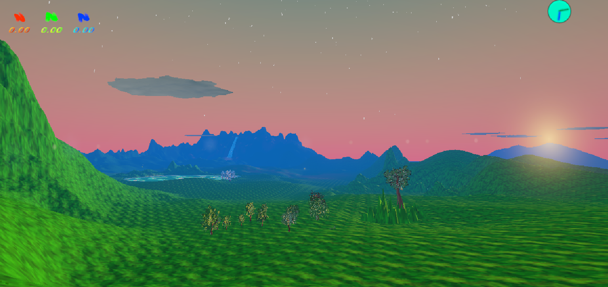
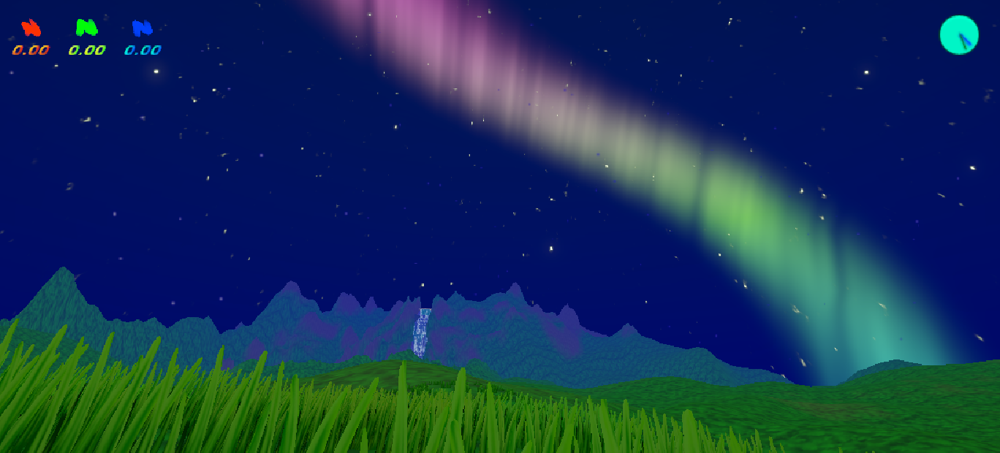
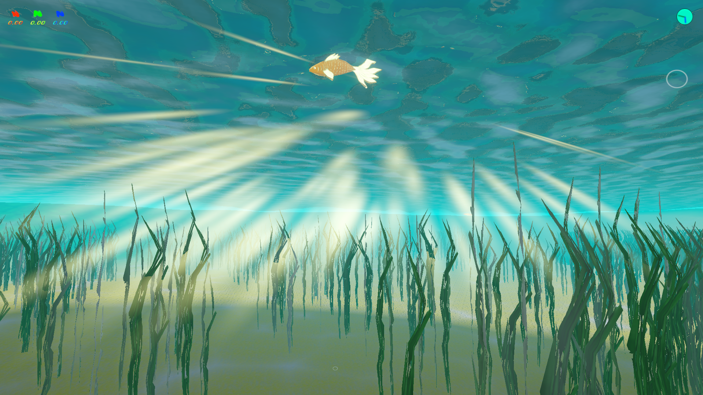
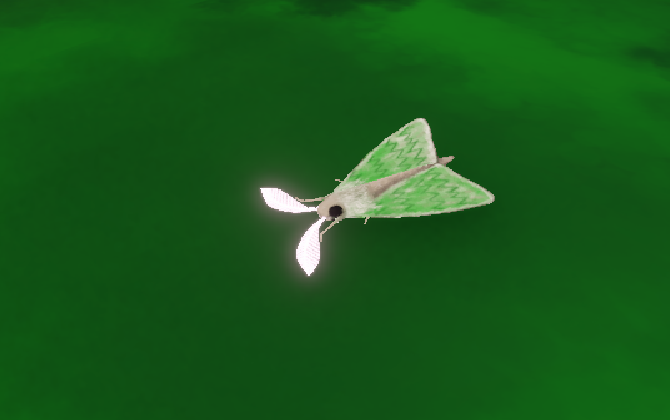
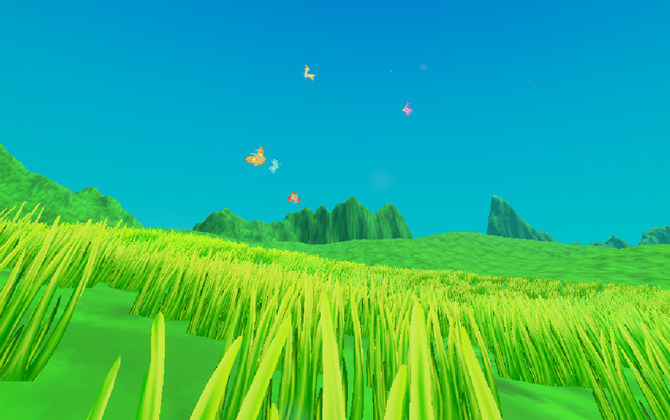
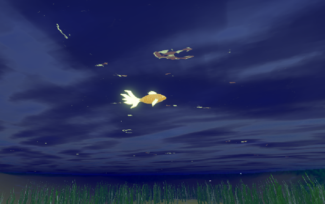
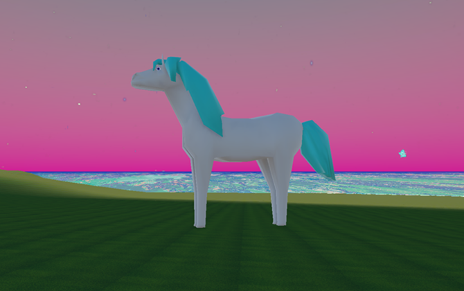
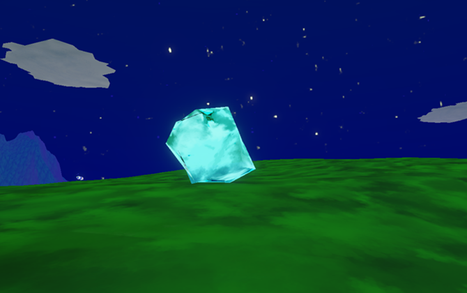

# Colourful Game
This is a game where you walk around an island, swim in the ocean and lakes and collect colours from various animals and objects, to then put them all together and create a Rainbow.

## Progress
Most of the game is done but still needs a lot of work

### Working on
- Spawning system
- Colour inventory
- Animals movements
- Underwater scenery

### Future Plans
- Make it multiplayer
- Add whales

  

🐞🐦‍🔥🐡🐛🐋🐬🐠

## In the game

### Day and Night cycle

### Underwater world

### Sources of colours

- ### Animals
    - Moths

        

    - Butterflies

        

    - Caterpilars

    - Fish

        

    - Crabs

    - Horses

        

- #### Objects
    - Rocks
    
        

_More sources will be added later_